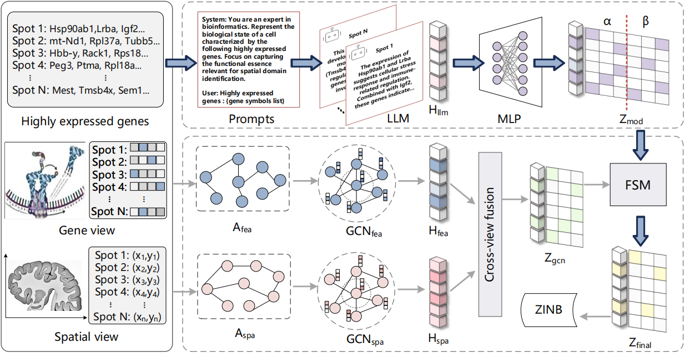

# When Genes Speak: A Semantic-Guided Framework for Spatially Resolved Transcriptomics Data Clustering
SemST is a framework that addresses a critical limitation in spatial transcriptomics data clustering: the disregard of the biological semantics of gene symbols. By harnessing LLMs, SemST directly transforms the symbol sets of highly expressed genes into biologically rich semantic embeddings, which are then used by the Fine-grained Semantic Modulation (FSM) module to modulate and guide spatial features. By enabling genes to “speak” their biological roles within a spatial context, SemST offers a more profound and insightful perspective on intricate tissue architecture.

# Environment

Python >= 3.9; required packages are as follows:
- numpy
- pandas
- scipy
- scikit-learn
- matplotlib
- scanpy
- anndata
- torch
- transformers
- tqdm
- POT

# Reproduce

- Step 1: Prepare the data
Download raw data, prepared LLM embeddings, and model weights from https://xxx and save to `data/`.

- Step 2: Preprocess the data
Run `python preprocess/MBA_generate_data.py` to preprocess the raw data and generate the required files.

- Step 3: Load weights and run
Run `python load_model_clustering.py` to reproduce the clustering results.

# Train

- Step 1: Download raw data and preprocess the data as above
- Step 2: Download the LLM `Qwen/Qwen3-4B-Thinking-2507` from [Qwen/Qwen3-4B-Thinking-2507 · Hugging Face](https://huggingface.co/Qwen/Qwen3-4B-Thinking-2507)
- Step 3: Run `python llm_generate_embedding.py` to generate LLM embeddings
- Step 4: Run `python train.py` to train the model

Pay attention to setting the correct path in the code.

The code is developed based on Spatial-MGCN and MAFN, thanks for their contributions.
https://github.com/cs-wangbo/Spatial-MGCN
https://github.com/zhubbbzhu/MAFN
